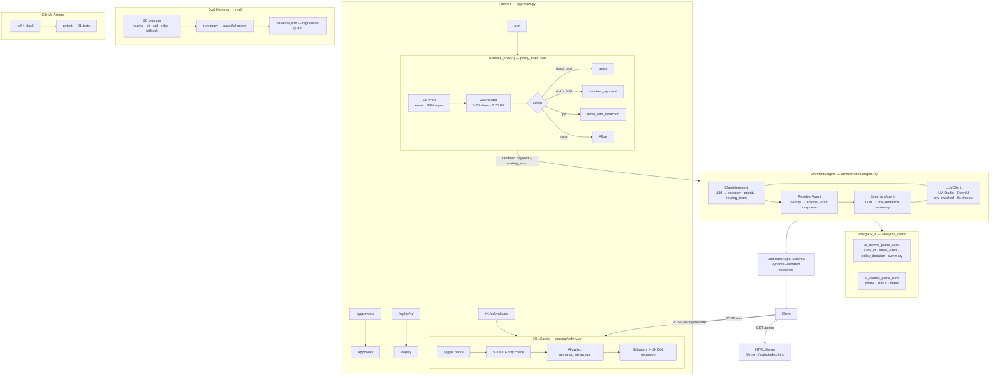

<p align="center">
  <picture>
    <source media="(prefers-color-scheme: dark)" srcset="assets/nh-logo-dark.svg" />
    <source media="(prefers-color-scheme: light)" srcset="assets/nh-logo-light.svg" />
    
  </picture>
</p>

<h1 align="center">ai_control_plane</h1>

<p align="center">
  <strong>Governance-first AI orchestration with policy enforcement,
  auditable decisions, and SQL safety for enterprise data platforms.</strong>
</p>

<p align="center">
  <a href="https://ai-control-plane.pages.dev">
    
  </a>
  &nbsp;
  <a href="https://github.com/nicholasjh-work/ai_control_plane">
    
  </a>
  &nbsp;
  <a href="LICENSE">
    
  </a>
</p>

<p align="center">
  
  
  
  
  
  
  
  
</p>

---

<table><tr><td>

Most AI prototype repos are prompt playgrounds. This one is a control plane: a FastAPI service that sits in front of agent workflows and enforces what they are allowed to do before, during, and after execution. Every request passes through a policy engine that scans for PII, assigns a risk score, redacts sensitive fields, and routes the request to the appropriate team — all driven by JSON config files with no hardcoded business logic. Requests that clear policy are handed to a three-agent pipeline (classifier, resolver, summarizer) backed by a provider-agnostic LLM client that falls back gracefully when the model is unavailable. Every outcome — allowed, redacted, approval-gated, or blocked — writes a structured audit record to PostgreSQL with a SHA-256–hashed email, a UUID audit ID, and full policy metadata. A sqlglot-based SQL safety layer enforces SELECT-only queries against an allowlisted set of semantic views, rejecting mutations before they reach the database. A 30-prompt eval harness with pass/fail scoring and baseline regression tracking completes the production readiness story. The intended audience is data platform engineers and ML platform teams who need governance primitives that can be audited, replayed, and extended without touching application code.

</td></tr></table>

---

## Architecture



*Architecture as of Phase 6. LLM calls fall back gracefully when the model is unavailable.*

---

## Components

**Control Plane**


**Governance**


**SQL Safety**


**Agents**


**Persistence**


**Eval**


---

## Quickstart

1. **Clone the repo**

   ```bash
   git clone https://github.com/nicholasjh-work/ai_control_plane.git
   cd ai_control_plane
   ```

2. **Install dependencies**

   ```bash
   make install
   ```

3. **Configure environment**

   ```bash
   cp .env.example .env
   # Edit .env — set DATABASE_URL, LLM_PROVIDER, LLM_BASE_URL, LLM_MODEL
   ```

4. **Create database tables**

   ```bash
   make migrate
   # Requires PostgreSQL running and DATABASE_URL set in .env
   # Tables created: ai_control_plane_audit, ai_control_plane_runs
   ```

5. **Start the server**

   ```bash
   make run
   # Starts uvicorn on http://localhost:8000
   # Open http://localhost:8000/demo for the interactive UI
   # Open http://localhost:8000/docs for the OpenAPI explorer
   ```

6. **Submit a ticket**

   ```bash
   curl -s -X POST http://localhost:8000/run \
     -H "Content-Type: application/json" \
     -d '{
       "title": "Invoice not received for March",
       "description": "I submitted my invoice on March 1st and have not received payment.",
       "requester_email": "contractor@company.com",
       "department": "finance",
       "system": "billing_portal",
       "urgency": "high"
     }' | python3 -m json.tool
   ```

7. **Validate a SQL query**

   ```bash
   curl -s -X POST http://localhost:8000/v1/sql/validate \
     -H "Content-Type: application/json" \
     -d '{"query": "SELECT * FROM v_ticket_summary"}' | python3 -m json.tool
   ```

8. **Run the eval harness** *(server must be running)*

   ```bash
   make eval
   # Runs 30 prompts, scores pass/fail, writes eval/results/latest.json
   # Exit 0 if pass_rate >= 90%

   make eval-regression
   # Fails if pass_rate drops more than 5 points from eval/baseline.json
   ```

9. **Run tests and lint**

   ```bash
   make test   # 21 unit tests, no live server or Postgres required
   make lint   # ruff + black --check
   ```

---

## LLM Configuration

Set `LLM_PROVIDER` in `.env` to switch models with no code changes:

| Provider | `.env` settings |
|---|---|
| LM Studio (local, default) | `LLM_PROVIDER=lmstudio`, `LLM_BASE_URL=http://localhost:1234/v1`, `LLM_MODEL=qwen2.5-coder-14b` |
| OpenAI | `LLM_PROVIDER=openai`, `OPENAI_API_KEY=sk-…`, `LLM_MODEL=gpt-4o-mini` |

All LLM calls have a 5-second timeout and fall back gracefully: routing defaults to the policy-level keyword result, summary returns `"unavailable"`. No request fails due to an unavailable model.

---

<p align="center">
  
  &nbsp;
  <a href="https://github.com/nicholasjh-work/ai_control_plane">
    
  </a>
</p>
